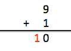
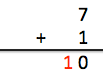
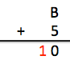
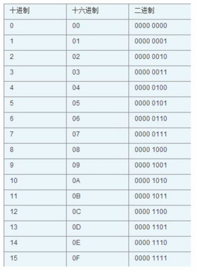

# 前言

## 进制

在计算机中，所有的程序都是以二进制的方式进行存储的，我们看到的数字其实是用`十`进制显示出来的。

对于任何一种进制---X进制，就表示某一位置上的数运算时是逢X进一位。十进制是逢十进一，十六进制是逢十六进一，二进制就是逢二进一，以此类推，x进制就是逢x进位。

编程中常见的进制有4种：

1. 十进制
2. 二进制
3. 八进制
4. 十六进制

也就是说，同一个整数，我们至少有4种表示方式。

### 十进制

十进制是我们最熟悉、最常用的一种计数方式，它有两个特点：由0、1、2….9十个基本数字组成。

> 运算规则是`逢十进一`

- 运算

所谓`逢十进一`，也就是当数值满十时，就要向前进一位



个位数为9+1，满十了，十位数就进一。

### 二进制

二进制是计算机内部使用的一种计数方式，它有两个特点：由`0`、`1`两个基本数字组成；

> 运算规则是`逢二进一`

如果有人问：为什么二进制里面没有2~9这些数字呢？你就告诉他，二进制是逢二进一，因此当数字满二的时候就会进位。

通常二进制是以`0b`或者`0B`开头的，比如`0b1010`是个二进制数，而`1010`则还是我们熟悉的十进制数，就是`一千零一十`

- 运算

比如`1+1`


个位数是`1+1`，值满`2`了，于是十位数要进`1`。

因此，在二进制中：1 + 1 = `0b10`，这里的`0b10`表示的是十进制中的`2`，并不是`10`

以此类推，11 + 1 = `0b100`


#### 二进制转为十进制

进制里面有个`基数`的概念，基数是用来计算数值的，比如十进制的基数是`10`，因此十进制是这样算数的：

12345 = 5 * 10(0) + 4 * 10(1) + 3 * 10(2) + 2 * 10(3) + 1 * 10(4) = 5 + 40 + 300 + 2000 + 10000 = 12345

二进制的基数是2，以此类推：

`0B`1011 = 1 * 2`(0)` + 1 * 2`(1)` + 0 * 2`(2)` + 1 * 2`(3)` = 1 * 1 + 1 * 2 + 0 * 4 + 1 * 8 = 1 + 2 + 0 + 8 = 11

因此二进制数`0B1011`表示的数值是十进制中的`11`

### 八进制

八进制有两个特点：由0~7八个基本数字组成；

> 运算规则是`逢八进一`

- 细节

由于十进制和八进制中都包含了0~7，为了区分开来，在书写八进制数的时候，需要在前面加个`0`。比如`0`76是个八进制数，76则是个十进制数。

- 运算



个位数是7+1，值满八了，于是十位数要进一。因此，在八进制中，7 + 1 = 010。010则表示十进制中的`八`，而不是`十`

#### 八进制转十进制

八进制的基数是8，因此`0`27计算出来就是十进制中的23

027 = 7 * 8`(0)` + 2 * 8`(1)` = 7 * 1 + 2 * 8 = 23

#### 二进制转八进制

不难发现一个十进制数可以表示的最大值是9，而一个八进制数可以表示的最大值是7，恰好3个二进制数可以表示的最大值`0b`111也是7。因此，我们可以用一个八进制数来代替3个二进制数。

`0b`11110011 = `0`b 011  110  011  = `0`363

如果是八进制转为二进制，那就反过来，用3位二进制数来表示1位八进制数

`0`25 = `0b` 010  101 = `0b`10101

### 十六进制

十六进制有两个特点：由0~9和A~F组成，A~F分别表示10~15；

> 运算规则是`逢十六进一`

- 细节

由于十进制、八进制、十六进制中都包含了0~7，为了区分开来，在书写十六进制数的时候，需要在前面加个`0x`或者`0X`。比如`0x`76是个十六进制数，076是个八进制数，76则是个十进制数。

- 运算



个位数是B+5，也就是11+5，值满十六了，于是十位数要进一。因此，在十六进制中，B + 5 = `0x`10。`0x`10则表示十进制中的“十六”，而不是“十”

#### 十六进制转十进制

十六进制的基数是16，F表示十进制中的15，因此`0x`2F计算出来就是十进制中的47

`0x`2F = 15 * 16`(0)` + 2 * 16`(1)` = 15 * 1 + 2 * 16 = 47

#### 二进制转十六进制

一个十六进制数可以表示的最大值是15，恰好4个二进制数可以表示的最大值`0b`1111也是15。因此，我们可以用一个十六进制数来代替4个二进制数。

`0b`11110011 = `0b` 1111  0011  = `0x`F3

如果是十六进制转为二进制，那就反过来，用4位二进制数来表示1位十六进制数

`0x`25 = `0b` 0010  0101=`0b`100101

### 小结

一个整数`99`的4种表示方式分别如下：

```
十进制：99
二进制：0b1100011
八进制：0143
十六进制：0x63
```

`c语言`中的代码为
```c
#include <stdio.h>

int main(void)
{
    int i = 99;  // 十进制
    int j = 0b1100011;  // 八进制
    int k = 0x63;  // 十六进制
    // C语言里没有二进制数的表示方法
    printf("%d \n", i);
    printf("%d \n", j);
    printf("%d \n", k);
    return 0;
}
```

- 使用printf进行输出

|格式符|功能|
|:--|:--|
|`%d`|以带符号的十进制形式输出整数|
|`%o`|以不带符号的八进制形式输出整数|
|`%x`|以不带符号的十六进制形式输出整数|
|`%u`|以不带符号的十进制形式输出整数|

- 二进制、十进制、十六进制对应关系



## 参考文献

- [【零基础学习iOS开发】【02-C语言】05-进制](http://www.cnblogs.com/mjios/archive/2013/05/24/3067219.html#labelTop)
- [百度百科--进制](https://baike.baidu.com/item/%E8%BF%9B%E5%88%B6)
- [进制之间的转换](http://c.biancheng.net/cpp/html/2855.html)