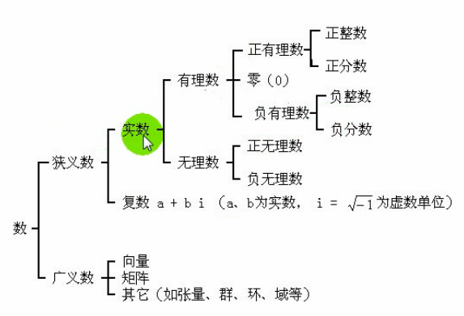
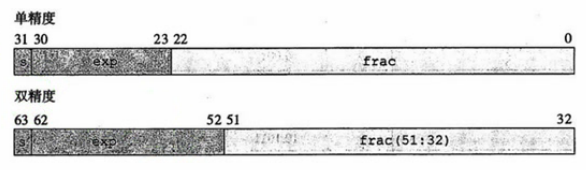

# 数据类型


在C语言中分为两中数据类型：

1. 基本数据类型；
2. 构造数据类型，把基本数据类型进行封装，变成一个新的数据类型；

## 整型


### 整型常量

- 十进制常数

```c
int x = 123;  // 正数
int y = -123;  // 负数
```

- 八进制

以0为前缀

```c
int x = 01234567;  // 正数
int y = -01234567;  // 负数
```

- 16进制

以0X或者0x为前缀，不区分大小写

```c
int x = 0xFE;  // 正数
int y = -0XFE;  // 负数
```

- 后缀

`L`和`U`不区分大小写

```c
int x = 100L;  // 长整型
int y = 100U;  // 无符号
int z = 100UL;// 混合
```

### 整型变量

- 声明和定义

```c
int i;  // 声明
i = 10;  // 定义
```

|类型|描述|所占字节|
|:--|:--|:--|
|`short`|短整型|2|
|`int`|整型|4|
|`long`|长整型|8|
|`long long`|更长的长整型|8|
|`signed`|有符号数|4|
|`unsigned`|无符号数|4|

```c
#include <stdio.h>

int main(void)
{
    printf("%d \n", sizeof(short));
    printf("%d \n", sizeof(int));
    printf("%d \n", sizeof(long));
    printf("%d \n", sizeof(long long));
    printf("%d \n", sizeof(signed));
    printf("%d \n", sizeof(unsigned));
    return 0;
}
```

> 不同的编译器环境下结果可能不一样，这里使用的是`cldeblocks`+`gcc`

- 默认的缺省值

```c
int as;  // unsigned int as
long la;  // long int la
unsigned long ula;  // unsigned long int ula
short sa;  // signed short int sa
unsigned short usa;  // unsigned short int usa
long long lla;  // long long int lla
unsigned long long ulla;  // unsigned long long int ulla
```

**变量与数据对象**

1. 变量的本质：一块连续的存储单元（内存、寄存器），不一定有地址；
2. 变量有名字，用来表示存储单元（左值）或存储单元的内容（右值）；
3. 数据对象没有名字，是一种具有数据类型的连续存储单元；

```c
int x = y;
// x == 左值
// y == 右值
// 把变量y的内容赋值给x
```

> 常量只能当右值

### 整型数据的溢出

- 整数数据的表示范围

```c
#include <stdio.h>
#include <limits.h>

int main(void)
{
    printf("%d \n", INT_MAX);  // INT类型所占空间最大值
    printf("%d \n", INT_MIN);  // INT类型所占空间最小值
    return 0;
}
```

```bash
$ ./hello 
2147483647 
-2147483648
```

- 整数数据的溢出

在计算过程中超出的数据的表示范围会导致溢出

```c
#include <stdio.h>
#include <limits.h>

int main(void)
{
    printf("%d \n", INT_MAX + 1);  // INT类型所占空间最大值+1
    printf("%d \n", INT_MIN - 1);  // INT类型所占空间最小值-1
    return 0;
}
```

```bash
$ ./hello 
-2147483648 
2147483647
```

当溢出之后，最大值和最小值的将会交换。

## 字符型

### ASCII码

`ASCII（American Standard Code for Information Interchange，美国信息交换标准代码）`是基于拉丁字母的一套电脑编码系统，主要用于显示现代英语和其他西欧语言。

> ASCII是American Standard Code for Information Interchange缩写，而不是ASCⅡ(罗马数字2)


- 标准ASCII码分类

0-31是控制字符或通信专用字符（不可显示），32-126是可显示字符，包括数字、字母标点符号等。

### 字符常量

- 字符常量

字符型数据在内存中以`ASCII码`形式进行存储，使用单引号引起来，如： `'A'`、`'*'`

```c
#include <stdio.h>

int main(void)
{
    char ch = 'A';  // ==> char ch = 65;
    printf("%c \n", ch);  // 以字符的方式进行输出
    printf("%d \n", ch);  // 以十进制的方式进行输出
    return 0;
}
```

```bash
$ ./hello 
A 
65
```

- 分类

普通字符变量和转义字符，其中转义字符又分为：

1. 制表符：`\t`
2. 回车符： `\r`光标往后移动一格
3. 换行符： `\n`

```c
#include <stdio.h>

int main(void)
{
    char ch = 'A', c = 65;
    printf("%c\t%c\n", ch, c);  // 制表符，换行符
    printf("%c\r%c\n", ch, c);  // 回车符，换行符
    return 0;
}
```

```c
$ ./hello 
A	A
A
```

### 字符变量

- 声明和定义

每个变量分配一个字节，允许对变量赋整数值，低8位赋值给字符变量，高位截断丢弃。

```c
char ch;
ch = 65; // ASCII 65 == A
printf("%c\n", ch);
return 0;
```

- 字符和整数之间可以直接进行数值运算

直接将字符`ASCII值`与整数进行运算

当右值运算时，存在整数提升，先转换成：char-->int

与浮点型运算，转换顺序：char-->int-->float

```c
#include <stdio.h>

int main(void)
{
    char ch = 'A';  // A ==> 65
    printf("%d\n", ch + 1);  // 65 + 1 = 66
    return 0;
}
```

```bash
$ ./hello 
66
```

### 字符的输入与输出

`%d`格式打印，`%c`格式打印

- printf函数在打印char时做了什么

一个字符可以以`%d`和`%c`的形式输出，printf函数接受的无论是`%d`还是`%c`，参数都会被转成`int`类型。

```c
#include <stdio.h>

int main(void)
{
    char ch = 'A';  // A ==> 65
    printf("%d\n", ch);
    printf("%c\n", ch);
    return 0;
}
```

```c
$ ./hello 
65
A
```

- scanf格式输入需要注意的地方

`%c`只接受一个字符，其余的丢弃，`%d`接收数据转换为二进制，存放在变量起始的连续四个存储单元中。

```c
#include <stdio.h>

int main(void)
{
    char ch;
    printf("请输入一个ASCII字符：");
    scanf("%c",&ch);
    printf("%d\n", ch);
    printf("%c\n", ch);
    return 0;
}
```

```bash
$ ./hello 
请输入一个ASCII字符：A
65
A
```

## 浮点型

可接近表示任意实数



**浮点型数据分类**

- float
- double
- long double

```c
float f;  // 声明
f = 12.04;  // 定义
printf("%f\n", f);  // 输出
```

浮点型数据存储，浮点数全都是有符号数



- 浮点数比较大小

```c
#define EPSILON 1E-6
if(abs(df1 - df2)<EPSILON)
    printf("df1=df2\n")
```

## 类型转换

当我们在进行运算，左边和右边的值类型不一样时就需要用到类型转换了。

### 隐式转换

当发生隐式转换的时候，编译器会自动帮我们转换。

**什么时候发生隐式转换**

1. 当算术或逻辑表达式中操作数类型不相同；
2. 当赋值运算符两侧类型不匹配；
3. 函数调用过程中形参、实参不匹配；
4. 当return语句表达式类型与函数返回类型不匹配；

```c
#include <stdio.h>

int test(void)  //  test函数要求返回整型
{
    return 1.1;  // 实际返回浮点型
}

int main(void)
{
    int i;
    i = test();  // 赋值运算
    printf("%d\n",i);  // 实际赋值的是整形1
    return 0;
}
```

```bash
$ ./hello 
1
```

**算术运算转换规则**

- 空间占用小的数据转换为空间大的数据
    1. 浮点数：`float` --> `double` --> `long double`
    2. 整数：`char` --> `int` --> `unsigned` --> `long` --> `unsigned long` --> `long long`
- 转换规则
    - 在C99中，可以将任何等级低于`int`或`unsigned`的类型转换到此类型，运行结束后转换。比如char
    - 如果连个书都没有浮点数，首先要将两个操作数整数提升
        1. 如果两个数都是无符号类型或者有符号类型，将等级较低的转换为等级较高的；
        2. 如果无符号数等级高于有符号数，将有符号数转换为无符号数类型；
        3. 如果有符号数类型可以表示无符号数类型的所有值，将无符号数转换为有符号数类型；
        4. 否则，将两个操作数都转换为与有符号数的类型相对于的无符号数；
- 转换等级
    1. long long、unsigned long long;
    2. long、unsigned long；
    3. int、unsigend int；
    4. short、unsigned short；
    5. char、unsigned char；
    6. _Bool；

**赋值运算转换规则**

- 字符转换为整型：高位补零；
- 整型转换为字符型：截断；
- 整型转换为浮点型：添加小数位；
- 浮点型转换为整型：截断小数位；
- 字符型转换为浮点型（中间经过整型）
    - 先提升为整型，然后再添加小数位；
- 浮点型转换为字符型（中间经过整型）
    - 截断小数位，然后截断

### 强制转换

程序员在程序中用强制运算符转换

```c
#include <stdio.h>

int main(void)
{
    char ch = (int)65.1415926;
    printf("%c\n", ch);
    return 0;
}
```
转换的是值，而不是变量的类型，类型是不会改变的。
```c
$ ./hello 
A
```

## C99新增类型

`C99标准`新增加的数据类型

### 布尔类型（_Bool）

布尔类型中，其值只能是`0`或者`1`，`0`为`false`，其他数值均为`true`

```c
#include <stdio.h>

int main(void)
{
    _Bool a = 0;
    _Bool b = 99;
    printf("%d \n", a);
    printf("%d \n", b);
    if(a)
        printf("true");
    if(b)
        printf("true");
    return 0;
}
```

```bash
$ ./hello 
0 
1 
true
```

C语言特意弄了个头文件，让我们定义布尔值和其他语言一样，使用`bool`定义而不是`_Bool`
```c
#include <stdio.h>
#include <stdbool.h>

int main(void)
{
    bool a = 0;
    bool b = 99;
    printf("%d\n",true);
    printf("%d\n",false);
    return 0;
}
```
在头文件中，你可以看到下面的源码，帮你定义了布尔类型：
```c
#define bool	_Bool
#define true	1
#define false	0
```

### 复数类型(_Complex)

- 半个关键字，需要与其他类型的关键字组合
    1. float _Complex
    2. double _Complex
    3. long double _Complex


```c
#include <stdio.h>
#include <complex.h>
#include <stdlib.h>

int main(void)
{
    double complex dc1 = 1.5 + 7.2 * I;
    double complex dc2 = 3.2 + 8.1 * I;
    double complex dc3 = dc1 + dc2;
    printf("%lf + %lfi\n",creal(dc3), cimag(dc3));

    return 0;
}
```