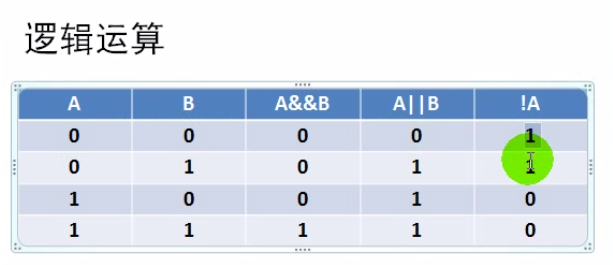

# 运算符与表达式

- 什么是运算符？
    - C语言定义的一些运算符号（`+-*/`...）；

- 什么是表达式？
    1. 表达式就是由运算符和操作数组成的一个符合C语法规则的式子序列；
    2. 单个常量或变量也是一个表达式；
    3. 根据运算符种类，可分为不同种类的表达式，比如算术表达式`3+5`、关系表达式`3 > 5`...；
    4. 表达式运算后的结果为表达式的值`int i = 1 +1`；
    5. 值的类型为表达式的类型；

- 什么是语句？
    1. 语句可分为简单语句和符合语句，简单语句以`;`结束；
    2. 语句是对计算机的指令：声明语句`int a;`、赋值`a=1`、函数调用、结构化语句、空语句、复合语句...；

## 运算符优先级

- 什么是优先级？
    1. 在一个表达式中，优先级高的运算符先选择操作对象`（2+3*4+5）`；
    2. 优先级用来确定运算符的操作对象，而不是用来确定运算次序`（2*3+4*5）`，后者是由编译器去决定的；
    3. C语言优先级一共16级，16级最高，1级最低；

- 如何记忆优先级？

`单目运算符` --> `算术运算符` --> `关系运算符` --> `逻辑运算符` --> `条件运算符` --> `赋值运算符` --> `逗号顺序求值`


## 运算符结合性

- 什么是结合性？
    1. 结合性就是一串操作符是从做往右依次执行还是从右往左依次执行；
    2. 当表达式中运算符优先级相同，那么运算符就会根据结合性来挑选操作数；

- 左结合与右结合
    1. 左边的运算符先挑运算对象，依次向右执行；
    2. 右边的运算符先挑运算对象，依次向左执行；
    3. 求值顺序和结合性无关，和编译器有关；

- 右结合型的运算符
    1. 单目运算符；
    2. 赋值运算符；
    3. 条件运算符；

```c
1 + 2 + 3;  // (1+2)+3 // 左结合
a = b = c;  // a=(b=c)  // 右结合
```

判断输入的年是否是闰年

```c
#include <stdio.h>
#include <stdlib.h>

int main(void)
{
    int year;
    printf("请输入一个年份：");
    scanf("%d", &year);
    if( year%4==0 && year%100!=0 || year%400==0)
        /*
        运算符顺序：
            1. 算术运算符(%)
            2. 关系运算符(==,!=)
            3. 逻辑运算符(&& > ||)
        */
        printf("%d是闰年\n", year);
    else
        printf("%d不是闰年\n", year);
    return 0;
}
```

```bash
$ ./hello 
请输入一个年份：2000
2000是闰年
$ ./hello 
请输入一个年份：1999
1999不是闰年
```

## 运算符分类

- C语言提供了48种运算符
    1. ANSIC：44中种运算符；
    2. C90增加了一元`+`运算符；区分前后缀++/--；
    3. C99增加了一个复合字面值运算符；

- 运算符的分类（根据需要的操作数）
    1. 单目运算符
    2. 双目运算符
    3. 三目运算符

### 算术运算符

#### 基本算术运算符

基本运算符

|运算符|描述|
|:--|:--|
|`+`|取正`（+4）`|
|`-`|取负`（-4）`|
|`+`|加|
|`-`|减|
|`*`|乘|
|`/`|除|
|`%`|求余|
|`++`|自增|
|`--`|自减|

#### 求余运算符

- 优先级和乘除相同
- 操作数必须是整数
    1. 字符型数据也可以求余运算
    2. 浮点数不能进行求余运算
    3. 指针也可以进行求余运算
    4. 负数也可以进行求余运算

```c
#include <stdio.h>

int main(void)
{
    printf("%d\n", 10 & 3);  // 整数可以进行求余运算
    printf("%d\n", -10 & 3);  // 整数可以进行求余运算
    printf("%d\n", 'a' & 'b');  // 字符可以进行求余运算，字符型在内存中是一个整数进行保存的
    // printf("%d\n",10.5 & 3);  // 不支持浮点数求余运算
    return 0;
}
```

#### 自增自减运算符

- 优先级大于乘除
- 后缀自增、自减
- 前缀自增、自减

```c
#include <stdio.h>

int main(void)
{
    int i,j = 0;
    printf("%d\n", i++);  // 先取值在进行运算 ==> 0
    printf("%d\n", i--);  // ==> 1
    printf("%d\n", ++j);  // 先运算在取值 ==> 1
    printf("%d\n", --j);  // ==> 0
    return 0;
}
```

#### 运算符使用需要注意的地方

- C99对新标准的`/`和`%`的修改
    1. C99中`/`的结果总是向零取整
    2. C99中`%`的值符号跟被除数相同
- 不清楚的地方、复杂的表达式加括号
    1. `a+++(++b)`与`a+++++b`
- 避免产生未定义的行为
    1. (i++)+(i++)+(i++)

### 赋值运算符

#### 左值、右值和数据对象

- 数据对象
    1. 用于保存变量或数组的数据存储区；
    2. 数据存储区的术语，作用是用来保存数据；
- 左值
    1. 用于标识一个特定数据对象的名字或表达式；
    2. 对象指的是实际的数据存储，左值用来表示存储在计算机内存中的对象，左值是一个用来识别或定位这个存储对象的标识符；
- 右值
    1. 指的是能赋给可修改的左值的量；
- 变量
    1. 变量即可以当左值，又可以当右值；
    2. 变量的名字是一个左值，用来标识存储的数据对象；
    3. 变量的值是一个右值，可以给可修改的左值赋值；


#### 简单赋值运算符与符合赋值运算符

- 简单赋值与简单赋值运算符
    - `=`
- 复合赋值与复合赋值运算符
    - `+=`、`-=`、`*=`、`/=`、`%=`
- 赋值运算符

#### 复制过程中的类型转换

- 浮点型数据复制给整型
- 整型数据赋值给浮点型
- 字符型数据赋值给整型
- 整型数据赋值给字符型

#### 使用赋值运算符需要注意的地方

- 赋值运算符的截断问题

```c
#include <stdio.h>

int main(void)
{
    int a;
    char b;
    int c = 1000;
    a = b = c;
    printf("%d",a);
    return 0;
}
```

```bash
$ ./hello 
-24
```

### 关系运算符

用来比较两个数的关系，比如数字`1`是否比数字`2`大。。

#### 关系运算符的使用

- 关系运算符
    1. <、<=、>、>=、==、!=
    2. 关系运算符的优先级
        - 较高：<、<=、>、>=
        - 较低：==、!=
    3. 结合性
        - 左结合
- 关系表达式
    1. 由关系运算符将操作数连接而成的式子；
    2. 表达式的结果是一个整型值，而不是一个布尔值；
    3. 一般用在`if`或`while`语句中作为条件判断；

- 关系运算符的结合性
    - `a<b<c`相当于`(a<b)<c>`
    - `a==b==c`用上

### 逻辑运算符

- 与、或、非
    - 双目运算符：&&、||，左结合性；
    - 单目运算符：!，右结合性；
    - 优先级：! > && > ||；
- 逻辑表达式
    - 运算符的操作数可以是常量、变量、表达式；
    - 表达式的值类型是整型；
    - 优先级：! > 算术运算符 > 关系运算符 > && > || > 赋值运算符；


#### 逻辑运算符的运算



#### 逻辑运算中的短路求值

- &&、||存在序列点
- 左操作数先求值
- 如果操作数能确定整个表达式的值，不再计算右值操作数的值

### 位逻辑运算符

- 实现对位的一些操作
    - `&(与)`、`|(或)`、`～(非)`、`^(异或)`、`<<(左移)`、`>>(右移)`；
    - 某位清零、置一、取反、异或、状态查询等操作；
- 位逻辑表达式
    - C语言中使用整数来代替逻辑表达式的布尔值；
    - C99中可以直接使用布尔类型；

```c
#include <stdio.h>

#define BIT_0 0x01 // 位掩码 // Bitmask
#define BIT_1 0x02
#define BIT_2 0x04
#define BIT_3 0x08
#define BIT_4 0x10
#define BIT_5 0x20
#define BIT_6 0x40
#define BIT_7 0x80

int main(void)
{
    int i = 0x01;
    int j = 0x0f;
    i &= 0x02; // == 0 某一位置一
    printf("%x\n", i);
    // i |= 0x02; // == 3
    // printf("%x\n", i);
    j = j & ~0x1;
    printf("%x\n", j);
    return 0;
}
```

#### 左移、右移运算符

- 属于逻辑移位
    1. 算术移位与逻辑移位的区别？
    2. 对移出位进行零填充；
- 移位计数的合法取值范围
    1. int型数据合法范围是[0,31]
- 位运算存在整数提升
    1. 当<<左操作数为字符、短整型时，会发生隐式类型转换；
    2. <<右操作数也要限制在其合法取值范围内；

### 条件运算符

- 基本用法

```c
#include <stdio.h>

int main(void)
{
    int i;
    // 表达式1?表达式2:表达式3:
    i = 2>1 ? 1+2 : 3*4;  // 如果2大于1，则把1+2的执行结果赋值给i,否则把3*4的执行结果赋值给i;
    printf("%d", i);
    return 0;
}
```

```c
#include <stdio.h>

int main(void)
{
    int a=3, b=4, c=5;
    int max = 0;
    max = (a < b ? b : a) < c ? c : a;  // 获取ABC中的最大值
    printf("%d",max);
    return 0;
}
```

### 逗号运算符

- 表达式1,表达式2,...,表达式n；
- 最后一个表达式的值是作为整个逗号表达式的值；
- 逗号表达式的优先级最低（优先级可以加括号）；

```c
#include <stdio.h>

int main(void)
{
    int i, j;
    i = 1,2,3+4,5*6,7/8,9%3;
    j = (1,2,3+4,5*6,7/8,9%3);
    printf("%d\n", i); // 1
    printf("%d\n", j); // 0
    return 0;
}
```

## 一些优先级

1. `.`的优先级高于`*`；
2. `.`的优先级高于`++`；
3. `[]`的优先级高于`*`；
4. 函数`()`的优先级高于`*`；
5. `==`和`!=`高于位操作；
6. ==和!=高于赋值运算符；
7. 算术运算符高于位移运算符；
8. 逗号运算符最低；